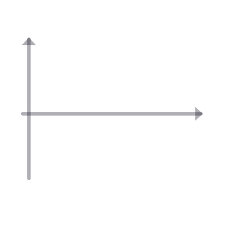

<div align="center">

  <picture>
    <source media="(prefers-color-scheme: dark)" srcset="./assets/logo-frameless-dark.gif" />
    <source media="(prefers-color-scheme: light)" srcset="./assets/logo-frameless.gif" />
    
  </picture>

</div>

<h1 align="center">MemoryKernelFitting.jl</h1>

<p align="center">
  <a href="https://github.com/Louhokseson/MemoryKernelFitting.jl/actions/workflows/CI.yml">
    
  </a>
  
  
  
  <a href="https://github.com/Louhokseson/MemoryElectronicFriction.jl">
    
  </a>
</p>

<div align="center">
  <h3>FDT-Safe Prony-Series Fits for Memory-Dependent Electronic Friction</h3>
</div>

---

<div align="justify">

<strong>MemoryKernelFitting.jl</strong> fits underdamped Prony-series memory kernels to
configuration-resolved spectral data. The resulting extended-variable stochastic
differential equation reproduces memory-dependent, configuration-dependent electronic
friction while preserving the fluctuation–dissipation structure required to sample the
correct Gibbs measure.

</div>

<div align="justify">

The input is a real-valued spectral density $\Lambda(x,\omega)$ on a configuration grid
$x$ and frequency window $\omega \in [0,\omega_{\max})$. The output is a compact set of
real and complex-conjugate modes from which the quasi-Markovian blocks
$\widetilde{\boldsymbol\Gamma}(x)$ and
$\widetilde{\boldsymbol\Sigma}(x)$ can be constructed.

</div>

$$
\Lambda_\theta(x,\omega)
=
a_0(x)
+
\sum_{k=1}^{K_R} a_k(x)\frac{\lambda_k}{\lambda_k^2+\omega^2}
+
\sum_{j=1}^{K_C} A_j(x)L(\omega;\alpha_j,\beta_j),
$$

$$
K(x,\tau)
=
2a_0(x)\delta(\tau)
+
\sum_k a_k(x)e^{-\lambda_k\tau}
+
\sum_j A_j(x)e^{-\alpha_j\tau}\cos(\beta_j\tau).
$$

## Features

<div align="left">

| **Component** | **Description** |
|---------------|-----------------|
| **Spectral model** | Zero-frequency white part, overdamped Lorentzians, and mirrored underdamped Lorentzian pairs through <code>spectral_density</code> |
| **Time-domain kernel** | Matching exponential and damped-oscillatory Prony series through <code>memory_kernel</code> |
| **Basis functions** | <code>lorentzian</code> and <code>mirrored_lorentzian</code>, implemented as an explicit one-sided cosine-transform pair |
| **Resonant modes** | Real $2\times2$ rotation blocks for complex-conjugate poles $\alpha\pm i\beta$, allowing peaks at nonzero frequency |
| **FDT-safe parameterisation** | Non-negative amplitudes represented structurally as squares, with stable positive decay rates |
| **Pole ladders** | Log-spaced and uniform fixed ladders with the identifiability box of the frequency window, through <code>log_ladder</code> and <code>uniform_ladder</code> |
| **Configuration dependence** | <code>GridAmplitudes</code> for the convex stage, plus polynomial and warped-Chebyshev bases for the smooth stage, behind one <code>AmplitudeModel</code> interface |
| **QGLE readout** | Extended-variable blocks and the closed-form block exponential through <code>qgle_blocks</code> and <code>exp_gamma22</code> |
| **Spectral data** | Atomic-unit loading of the configuration-resolved spectra, graded-grid quadrature weights, and logarithmic frequency subsampling |
| **Validation** | Tests for symmetry, resonance onset, Markovian limits, dimension checks, numerical kernel–spectrum consistency, and fluctuation–dissipation structure |
| **Fitting pipeline** | Weighted objective and fixed-ladder per-configuration NNLS implemented; the coupled roughness solve and optional diagnostic VARPRO remain planned |

</div>

## Installation

<div align="left">

**Prerequisites:** Julia ≥ 1.10
([download](https://julialang.org/downloads/)). The package is in early development and
is not yet registered in the Julia General registry.

**Setup:**

```julia
julia> using Pkg
julia> Pkg.develop(url="https://github.com/Louhokseson/MemoryKernelFitting.jl")
julia> Pkg.test("MemoryKernelFitting")
```

For local development from a clone:

```bash
julia --project=. -e 'using Pkg; Pkg.instantiate(); Pkg.test()'
```

</div>

## Quick Start

<div align="left">

```julia
using MemoryKernelFitting

a₀ = 0.0                                      # white / instantaneous part
a, λ = [0.75], [10.0]                         # overdamped modes
A, α, β = [1.5, 0.4], [0.5, 1.2], [3.0, 7.0] # underdamped pairs

Λω = spectral_density(3.0, a₀, a, λ, A, α, β)
Kτ = memory_kernel(0.2, a, λ, A, α, β)

# Markovian anchor: the zero-frequency friction used by standard MDEF
Λ₀ = spectral_density(0.0, a₀, a, λ, A, α, β)
```

The white contribution $2a_0\delta(\tau)$ is intentionally excluded from
<code>memory_kernel</code>; it enters the dynamics as instantaneous friction rather
than through the regular memory convolution.

</div>

## Development Status

<div align="justify">

The model, data, objective, and fixed-ladder stage-1 fit are implemented and tested:
spectral and time-domain evaluation, the two basis functions, pole ladders, the three
configuration-dependent amplitude representations, QGLE readout, atomic-unit spectral
data loading, the weighted objective, and independent per-configuration NNLS.

</div>

<div align="justify">

The remaining fitting work is the $\mu$-coupled roughness solve and the stage-2
coefficient fit that compresses the grid amplitudes into a smooth representation.
Outer variable projection is an optional pole diagnostic rather than part of the
fixed-ladder production path.

Design decisions with lasting consequences are recorded in
<a href="docs/design/"><code>docs/design/</code></a>, and progress is logged in
<a href="docs/DEVLOG.md"><code>docs/DEVLOG.md</code></a>.

</div>

## Repository Layout

<div align="left">

| Path | Contents |
|------|----------|
| [<code>src/</code>](src) | Package implementation and public model-evaluation API |
| [<code>test/</code>](test) | Unit and numerical cosine-transform consistency tests |
| [<code>docs/PronySeries/</code>](docs/PronySeries) | QGLE derivation, optimisation problem, and theory handover notes |
| [<code>assets/</code>](assets) | Static and animated package logos plus the animation generator |
| [<code>data/</code>](data) | Local spectral and simulation data; large outputs are not tracked |
| [<code>plots/</code>](plots) | Generated visualisations and fitting diagnostics |
| [<code>notebooks/</code>](notebooks) | Exploratory analysis notebooks |

</div>

## The Fitting Model

The mirrored underdamped basis is

$$
L(\omega;\alpha,\beta)
=
\frac{\alpha}{2}
\left[
\frac{1}{\alpha^2+(\omega-\beta)^2}
+
\frac{1}{\alpha^2+(\omega+\beta)^2}
\right],
\qquad
a_0,a_k,A_j\ge 0.
$$

<div align="justify">

<strong>The underdamped pairs are mandatory, not a refinement.</strong>
The target spectra are not monotone in $\omega$: they carry a resonance at
$\omega_{\mathrm{pk}}\approx1.02$–$1.15\,|h(x)|$ that sweeps from zero up to
$9.4\,\mathrm{eV}$ as the electronic level crosses the Fermi energy. A sum of
zero-centred Lorentzians is strictly decreasing and cannot produce such a peak;
complex-conjugate pole pairs can.

</div>

<div align="justify">

The mirror in $L$ follows from realness rather than modelling preference.
Because $\boldsymbol\Gamma_{2,2}$ is real, its complex eigenvalues
$\alpha\pm i\beta$ occur in conjugate pairs and generate Lorentzians at
$\omega=\pm\beta$ with half-width $\alpha$. The pair is a genuine resonance when
$\beta>\alpha/\sqrt{3}$; below that threshold it merges continuously into a monotone,
zero-centred response.

</div>

### FDT-Safe Construction

Set $m=K_R+2K_C$ and retain real rotation blocks:

```math
\boldsymbol\Gamma_{2,2}
=
\text{blockdiag}
\left(
\lambda_1,\ldots,\lambda_{K_R},
R(\alpha_1,\beta_1),\ldots
\right),
\qquad
R(\alpha,\beta)
=
\begin{pmatrix}
\alpha & \beta\\
-\beta & \alpha
\end{pmatrix}.
```

$$
\widetilde{\boldsymbol\Gamma}_{1,1}(x)=a_0(x),
\qquad
\boldsymbol g(x)
=
\left(
\sqrt{a_1},\ldots,\sqrt{A_1},0,\ldots
\right)^T,
\qquad
\widetilde{\boldsymbol\Gamma}_{2,1}=\boldsymbol g,
\quad
\widetilde{\boldsymbol\Gamma}_{1,2}=-\boldsymbol g^T.
$$

Two structural consequences make the fit well posed:

- **Amplitudes are squares.** The fluctuation–dissipation theorem reduces the coupling
  to one fitted function $\boldsymbol g(x)$ and enforces non-negative $a_k$ and $A_j$.
  A negative fitted amplitude is therefore a hard signal that no Gibbs-consistent
  QGLE within this ansatz reproduces the data.
- **$\boldsymbol Q=\boldsymbol I$ survives.**
  Each real rotation block gives
  $\boldsymbol g^T e^{-\tau R}\boldsymbol g
  =|\boldsymbol g|^2e^{-\alpha\tau}\cos(\beta\tau)$ and
  $R+R^T=2\alpha\boldsymbol I$, so
  $\widetilde{\boldsymbol\Sigma}_2=\sqrt{2\alpha}\,\boldsymbol I_2$.
  The stability requirement is
  $\boldsymbol\Gamma_{2,2}\boldsymbol Q
  +\boldsymbol Q\boldsymbol\Gamma_{2,2}^T\succ0$, not symmetry of the drift matrix.

### Fitting Strategy

<div align="justify">

The model is linear in the amplitudes and nonlinear only in the poles, so variable
projection separates the optimisation into an inner convex non-negative least-squares
problem and an outer low-dimensional pole search. Relative residual weights are needed
because $\Lambda$ spans approximately $10^{-12}$ to $10^4$; configuration-space
quadrature weights correct a grid where 83% of the columns cover only 6.7% of the
range; and roughness regularisation prevents near-degenerate poles from exchanging
amplitude arbitrarily.

</div>

<div align="justify">

Rates are shared across configurations while amplitudes vary with $x$. This is the
regime in which the two-time path-ordered kernel collapses exactly to a Prony series in
the lag. Allowing poles to track $x$ instead is an adiabatic approximation that fails
most strongly near the crossing, where
$\tau_{\mathrm{mem}}/\tau_{\mathrm{conf}}\approx34$ even at 300 K. A tiling argument
gives $K_C=30$ pairs ($m=60$), but the measured fixed-ladder fit plateaus near
$K_C\approx10$ ($m=20$); the final ladder should therefore be chosen from measured
accuracy and integration cost rather than the tiling estimate alone. Once the ladder is
fixed, the outer search disappears and the amplitude fit is a convex NNLS problem with
a global optimum.

</div>

## Documentation

The detailed theory and optimisation specification live in
[<code>docs/PronySeries/</code>](docs/PronySeries):

| File | Contents |
|------|----------|
| <code>Prony series (corrected).md</code> | Canonical QGLE derivation, two-time kernel, and FDT pairing |
| <code>Prony_fit_optimisation_problem.md</code> | Full fitting objective, calibration, and underdamped-series construction |
| <code>HANDOVER.md</code> | Index and development handover |

## Citation

This package builds on the quasi-Markovian GLE and underdamped memory-kernel
constructions described in:

- Sachs, *PhD thesis* (University of Edinburgh, 2017), Eq. (3.7) and §4.7.2.
- Leimkuhler and Sachs (2019), *Ergodic Properties of Quasi-Markovian GLEs with Configuration Dependent Noise*.
- Stella, Lorenz, and Kantorovich, *Physical Review B* **89**, 134303 (2014).
- Lei, Baker, and Li, *PNAS* **113**, 14183 (2016).

If you use <code>MemoryKernelFitting.jl</code> in published work, cite the relevant
theory above and this repository:

```bibtex
@software{MemoryKernelFitting_jl,
  author = {Lu, Xuexun},
  title  = {{MemoryKernelFitting.jl}: FDT-safe Prony-series fits for memory-dependent electronic friction},
  year   = {2026},
  url    = {https://github.com/Louhokseson/MemoryKernelFitting.jl}
}
```


## License

This project is licensed under the [MIT License](./LICENSE). See the full text for details.

---

<div align="center">

<br/>

[**Xuexun Lu (Hokseon)**](https://louhokseson.github.io)<br>
*PhD Candidate, The Maurer Computational Surface Science Group*<br>
The University of Warwick, UK

[](mailto:louhokseson@gmail.com)
[](https://orcid.org/0009-0004-4916-5970)
[](https://scholar.google.com/citations?user=233SExsAAAAJ&hl=en)

<br/>

</div>

<div align="center" style="font-size: 0.85em; color: #666; margin-top: 1em;">
Copyright © 2026 Xuexun Lu. Licensed under the MIT License.
</div>
